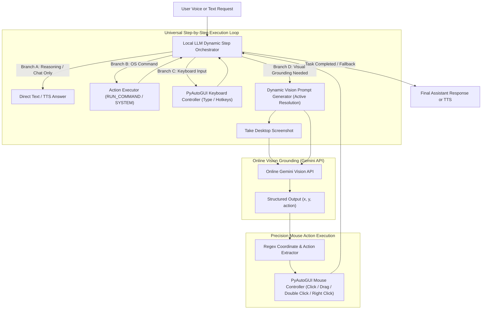

# ⚡ Vaa - Advanced Windows Voice & Desktop Agent

Vaa is an intelligent, agentic Windows personal assistant capable of understanding natural language voice and text commands. It features a modern desktop GUI, continuous voice recognition, and an **Agentic Router & Hierarchical Visual Architecture** with multi-model capability routing, structured command templates, step-by-step task orchestration, and automated self-correction loops.

---

## 🏛️ Universal Dynamic Hybrid Architecture

Vaa uses a **Universal Dynamic State Machine Loop** to orchestrate multi-step tasks. At each iteration, the Local LLM evaluates the task state and decides what action type is needed next (pure chat answer, OS command, consecutive visual mouse clicks via Gemini API, or keyboard input):



---

## 🚀 Development Progress & Tracking

| Phase | Component | Status | Details |
| :--- | :--- | :---: | :--- |
| **Phase 1** | **Architecture & Workflow Design** | ✅ Completed | Defined Hierarchical Hybrid workflow: Local LLM for orchestration/prompt generation, Online Gemini API for precision visual grounding. |
| **Phase 2** | **Dynamic Vision Prompt Generation** | ✅ Completed | Implemented resolution detection (`pyautogui.size()`) and context-aware prompt templates for screen localization. |
| **Phase 3** | **Online Vision API Integration** | ✅ Completed | Ensured all visual grounding requests (`LOCATE_CLICK`, `LOCATE_VERIFY`) route exclusively to Gemini API with robust logging. |
| **Phase 4** | **Regex Action Extractor & Mouse Control** | ✅ Completed | Implemented regex parsing for coordinates `(x, y)` and actions (`CLICK`, `DOUBLE_CLICK`, `RIGHT_CLICK`, `DRAG`) with PyAutoGUI execution. |
| **Phase 5** | **Stateful Step Orchestrator Loop** | ✅ Completed | Upgraded `assistant.py` with Universal Dynamic State Machine Loop supporting arbitrary sequences of actions and typing. |

---

## 💡 Key Features & Workflow

### 1. Stateful Step Orchestration
When a complex command is received (e.g., *"Open Notepad, click the text area, and write a leave letter"*), Vaa executes step-by-step:
1. Launches the application (`notepad.exe`).
2. Detects screen resolution (`1920x1080`), generates a targeted visual prompt, captures a screenshot, and queries Gemini API for exact interaction coordinates.
3. Clicks the target coordinate via PyAutoGUI.
4. Uses the Local LLM to generate the requested text content and types it into the active window.

### 2. Intent Classification & Routing
Every prompt is analyzed by the **Intent Router** to determine if the user wants to hold a normal conversation (`CHAT`) or perform a task (`ACTION`).
- **Chat & Step Orchestration:** Handled locally for high privacy and fast planning.
- **Vision & Localization Actions:** Always routed to high-capability cloud APIs (**Google Gemini API**) for superior screen understanding and precise mouse coordinates.

### 3. Universal Command Templates
Vaa uses universal structured command tags:
```xml
<CMD>RUN_COMMAND: notepad.exe</CMD>
<CMD>VISION: LOCATE_CLICK: Notepad text editing area</CMD>
```

### 4. Execution Validation & Self-Correction Loop
If an LLM hallucinates an invalid command format or an OS subprocess throws an error, Vaa captures the error internally and initiates a **Self-Correction Retry Loop**, prompting the LLM to fix the command.

---

## 🛠️ Project Structure
- `main.py` - Application entry point supporting CLI arguments and GUI initialization.
- `ui/gui.py` - CustomTkinter graphical interface with asynchronous queue-based event handling.
- `src/assistant.py` - Core agentic brain containing the Intent Router, Template Generator, and Self-Correction Loop.
- `src/actions.py` - Windows OS execution engine, subprocess handlers, and API integrations.
- `src/config.py` - Configuration, API key management, model definitions, and retry utilities.
- `src/speech.py` - Speech-to-text (STT) and Text-to-speech (TTS) engines.
- `src/vision.py` - Screenshot, visual coordinate detection, and screen recording utilities.
