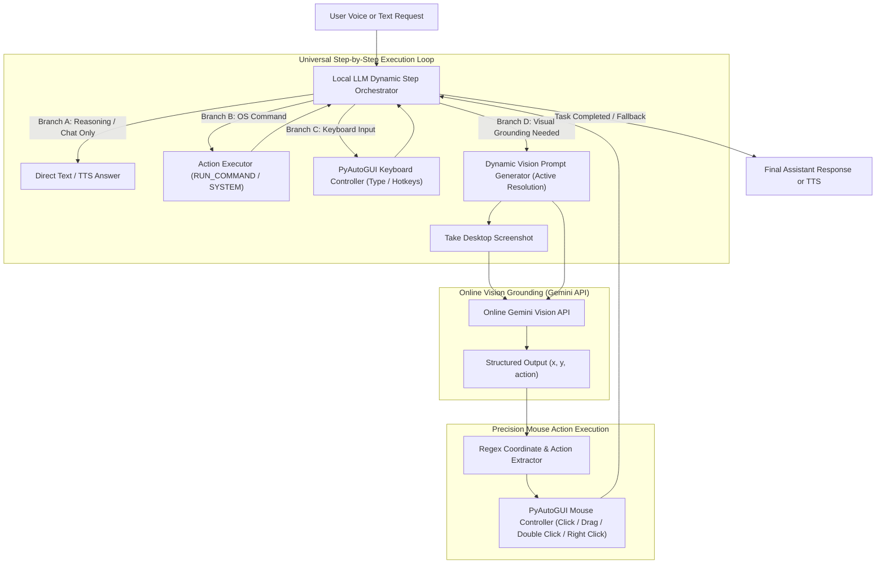

# Vaa Universal Dynamic Hybrid Agent Architecture

This document outlines the architecture and execution flow of the **Vaa Agentic Visual Assistant**.

## 1. Universal Dynamic Step-by-Step Architecture

Unlike rigid linear scripts, Vaa uses a **Universal Dynamic State Machine Loop**. At each iteration, the Local LLM evaluates the task state and dynamically decides what action type is needed next. A task may require 0 mouse actions (pure reasoning), 4 consecutive mouse clicks (navigating nested settings tabs), keyboard typing, or OS command execution.

## 2. Dynamic Workflow Flexibility

Because the orchestrator loops dynamically, it seamlessly supports diverse real-world workflows:

### Example A: Complex UI Navigation (Multiple Visual Actions in a Row)
*Request: "Open Settings, go to the Display tab, and click on Resolution"*
1. **Iteration 1 (OS Command):** Local LLM outputs `<CMD>RUN_COMMAND: start ms-settings:</CMD>` or opens Settings.
2. **Iteration 2 (Visual Mouse Click 1):** Local LLM sees that navigating to "Display tab" requires visual grounding. Generates prompt for display tab coordinates -> Gemini API returns coords -> PyAutoGUI clicks.
3. **Iteration 3 (Visual Mouse Click 2):** Local LLM evaluates that navigating to "Resolution dropdown" requires another visual check. Generates prompt for resolution section -> Gemini API returns coords -> PyAutoGUI clicks.
4. **Iteration 4 (Completion):** Local LLM confirms task is done and speaks completion message.

### Example B: Application Launch & Typing
*Request: "Open Notepad and write a leave letter"*
1. **Iteration 1 (OS Command):** Launches `notepad.exe`.
2. **Iteration 2 (Visual Mouse Click):** Queries Gemini API to click text editing area.
3. **Iteration 3 (Keyboard Typing):** Local LLM generates leave letter content and types via PyAutoGUI.

### Example C: Pure Knowledge Question (No Visual / OS Actions)
*Request: "What is the capital of France?"*
1. **Iteration 1 (Direct Reasoning):** Local LLM immediately outputs the answer without any screenshots or OS commands.

## 3. Self-Correction & Fallback Loop
At any iteration, if a command fails or a visual element is missing on screen, the error message or visual feedback is returned to the Local LLM. The LLM can self-correct (e.g., scroll down or retry query) or provide a graceful fallback response.
